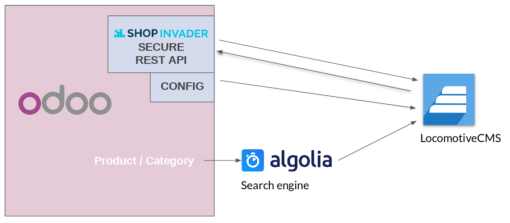

 {#h.on2icwt3gztl .c31}

[Intro & Big Picture](#h.17tifces9sv7)        [2](#h.17tifces9sv7)

[Glossary](#h.yakuljkxmjn9)        [2](#h.yakuljkxmjn9)

[System Workflow](#h.wzeoiej2rwxg)        [3](#h.wzeoiej2rwxg)

[About users](#h.8x8viqqoeh84)        [3](#h.8x8viqqoeh84)

[Installation &
Configuration](#h.pwjl534wzpu1)        [4](#h.pwjl534wzpu1)

[Odoo installation (optional) &
settings](#h.futxc68yipjc)        [12](#h.futxc68yipjc)

[Algolia Account setup](#h.futxc68yipjc)        [12](#h.futxc68yipjc)

[Download the template](#h.futxc68yipjc)        [12](#h.futxc68yipjc)

[Template components](#h.sywxw0kkpmry)        [13](#h.sywxw0kkpmry)

[Template File Structure](#h.q35zxxmcf7ct)        [13](#h.q35zxxmcf7ct)

[E-commerce global objects
(store.\*)](#h.3bs9189w9l9m)        [14](#h.3bs9189w9l9m)

[store.cart](#h.jl12gstqaf8o)        [14](#h.jl12gstqaf8o)

[store.customer](#h.2hv3yeovxch0)        [14](#h.2hv3yeovxch0)

[store.addresses](#h.wuem1z4d6yv6)        [14](#h.wuem1z4d6yv6)

[store.product](#h.z8234ibkjo2e)        [15](#h.z8234ibkjo2e)

[Price](#h.zgee8j2sk238)        [15](#h.zgee8j2sk238)

[store.sales](#h.9zlpo5o7vinl)        [15](#h.9zlpo5o7vinl)

[store.last\_sale](#h.r4aywax1n1s6)        [15](#h.r4aywax1n1s6)

[\_store object](#h.b5sgn1cnjxk)        [16](#h.b5sgn1cnjxk)

[store.available\_country](#h.4ksy0qtjqjxv)        [16](#h.4ksy0qtjqjxv)

[store.currencies\_format](#h.hdos8ot7f3iu)        [16](#h.hdos8ot7f3iu)

[store.currencies\_format](#h.jzf15kkjjcwl)        [16](#h.jzf15kkjjcwl)

[store.cache](#h.6hb6pk2ntggj)        [16](#h.6hb6pk2ntggj)

[ShopInvader special
tags/attributes](#h.1qdr0tphvlz0)        [17](#h.1qdr0tphvlz0)

[Javascript](#h.9qezj2t18sps)        [17](#h.9qezj2t18sps)

[data-shopinvader-form
tag](#h.gi2leuy0w8ez)        [17](#h.gi2leuy0w8ez)

[LIQUID](#h.bdc7uzqs2umi)        [17](#h.bdc7uzqs2umi)

[erp](#h.bppk19pfsgh6)        [17](#h.bppk19pfsgh6)

[Store-related special
actions](#h.wmclcr605u1t)        [18](#h.wmclcr605u1t)

[Practical examples](#h.futxc68yipjc)        [19](#h.futxc68yipjc)

[Deploy it !](#h.sxa3tvurcd1x)        [19](#h.sxa3tvurcd1x)

* * * * *

 {#h.t4zl4ruc1fdw .c31}

Intro & Big Picture {#h.17tifces9sv7 .c39}
===================

Shopinvader is divided in 3 parts:

-   An ERP: Odoo
    [https://www.odoo.com/](https://www.google.com/url?q=https://www.odoo.com/&sa=D&ust=1544628598989000) 

This is where all the business related tasks are done (handling of the
sale orders, stock management..)

-   A Content Management System : Locomotive
    [https://www.locomotivecms.com/](https://www.google.com/url?q=https://www.locomotivecms.com/&sa=D&ust=1544628598989000) 

This is what’s behind your website, it manages dynamic web pages and can
serve blogs, portals and stores

-   A Search Engine : Algolia

This is what indexes all your products and allows to fuzzy search in it

These components communicate between them as follows:

\

Glossary {#h.yakuljkxmjn9 .c18}
--------

Odoo: It’s the ERP. It’s where you define products, categories, store
the sell orders, manage stock, accounting, purchases…

Odoo store its data in postgresql database.

LocomotiveCMS : Locomotive is the CMS. It’s the engine of the e-commerce
website. It’s where you write public content like blog posts, pages.

Locomotive stores its data in a mongodb database.

Locomotive provides a “backoffice” for editing contents.

Locomotive documentation can be found here:
[https://doc.locomotivecms.com/docs](https://www.google.com/url?q=https://doc.locomotivecms.com/docs&sa=D&ust=1544628598992000) 

Locomotive-shopinvader-gem: It’s an addon of locomotive which take care
of all the communication between locomotiveCMS and Odoo.

\
Locomotive template: it’s the template of your website. It defines the
layout of the pages, the styles, the structure. It’s where you put your
HTML / JS / CSS.

Wagon : Wagon allows the designer to tests his template locally and
manage the deployment of the template to locomotive production server.

 

Algolia: It’s a search engine. Odoo sends the products and categories to
algolia. Locomotive and the user’s browser fetch products and categories
from Algolia.

Why we need a search engine ? It offers us a very rich set of search
features like facetting, search by synonyms and spelling. It’s effective
and provide very good performances.

System Workflow {#h.wzeoiej2rwxg .c18}
---------------

Odoo push configuration to Locomotive.

Odoo push products and categories to Algolia.

Locomotive fetch from Aloglia products and categories.

Locomotive push and fetch from Odoo carts and other customer
informations.

About users {#h.8x8viqqoeh84 .c18}
-----------

Odoo users are employees. It can be inventory users, managers,
accountants. They redact product descriptions, ensure payments, pack and
ship orders, etc.\
Locomotive administrative users are webmasters and other people related
to website editing.

Locomotive users are customers. Their addresses (name, street, city,
phone, mail) are stored in odoo while their credentials (login/password)
are stored in Locomotive.

There is also technical users / accounts.\
Odoo connects to locomotive with an account.

Locomotive connects to odoo with an account.

Odoo connects to algolia with an account.\
Locomotive connects to algolia with an account.

* * * * *

Installation & Configuration {#h.pwjl534wzpu1 .c39}
============================

1.  Installation

1.  Install docker. Refer to:

[https://docs.docker.com/install/linux/docker-ce/ubuntu/\#extra-steps-for-aufs](https://www.google.com/url?q=https://docs.docker.com/install/linux/docker-ce/ubuntu/%23extra-steps-for-aufs&sa=D&ust=1544628598996000)

2.  Install docker composer. Refer to:

[https://docs.docker.com/compose/overview/](https://www.google.com/url?q=https://docs.docker.com/compose/overview/&sa=D&ust=1544628598996000)

3.  Clone the shopinvader-getting-started repository

git clone https://github.com/akretion/shopinvader-getting-started.git

4.  Start docker:

Navigate to your shopinvader-getting-started directory and start docker
compose.

                        cd shopinvader-getting-started

docker-compose up

psst : use “docker-compose up -d” if you want to use your terminal while
the server is up. You can then use “docker-compose down” to stop it.

ps: In case of “ERROR: Couldn't connect to Docker daemon at
http+docker://localunixsocket - is it running?”  - use sudo, but you
should prefer adding your user to the docker group for continued use.

Now we have running Odoo and Shopinvader instances.

        The Shopinvador can be found in port 3000

Frontend:[ http://localhost:3000](https://www.google.com/url?q=http://localhost:3000/&sa=D&ust=1544628598998000)\
        Backend:[ ](https://www.google.com/url?q=http://localhost:3000/locomotive&sa=D&ust=1544628598998000)[http://localhost:3000/locomotive](https://www.google.com/url?q=http://localhost:3000/locomotive&sa=D&ust=1544628598998000)\
                Login credentials: \
                    user :
[demo@shopinvader.co](mailto:demo@shopinvader.com)[m](mailto:demo@shopinvader.com)

            password: akretion

The Odoo can be found on port 8069

Backend: http://localhost:8069\
                Login credentials:\
                    user: admin

                               password : admin

2.  Create Algolia
    account:[ https://www.algolia.com/](https://www.google.com/url?q=https://www.algolia.com/&sa=D&ust=1544628598999000)

1.  Create new Algolia application from the dashboard

For more information refer to the Algolia documentation:
https://www.algolia.com/doc/

3.  Configuration

1.  Odoo - Algolia Backend:\
    Connectors → Algolia Backends → Search Engine Connector
                    

In the Demo Algolia Backend (Or you own) fill:\
“APP ID” and “API KEY”, the values can be found in Algolia →
my\_application → API keys “Application ID” and “Admin API Key”
respectively

In the same backend object, we should configure our indexes for product
and categories synchronization. We will need one index for category and
one index for product for each website language. The index should end
with the language code I.e index\_name\_product\_en\_US

2.  Odoo Shopinvader backend - Algolia connection

The Odoo Shopinvader backend can be found under Shopinvader → Backends

To be able to export products and categories to Algolia, one need to add
those products/categories to the related Odoo Shopinvader backend.

The Odoo Algolia backend and the Odoo Shopinvader backend are related
with the “Search Engine” field defined on the Shopinvader backend.

1.  Add Products and categories to the backend:\
    Shopinvader → Backends → Select the backend → Click on “Bind
    Products” button and add products.\
    Click on “Bind category” to add some categories        
2.    Sync products and categories to Algolia        

Normally the categories and products synchronization is done by a
cronjob, but one can also do it manually:        

Click on the index most right icon.

1.  Click Recompute – this will create a json object for all product and
    categories
2.  Click Export – this will check if there is a change to the json
    objects from the last time and sync the updated products\
            

           DO NOT CLICK ON CLEAR - this will delete all products

3.   Connect Shopinvader to Algolia

1.  In shopinvader backend go to  “Store Settings” → Algolia and fill
    the “Application” and “API Key” from the Algolia → API Keys
    “Application Id” and “Search-Only API Key”\
    For   “Store Settings” → “INDICES” - “index”, put the start from the
    Odoo Algolia backend index without the language specification at the
    end.

2.  Show products from Algolia in Shopinvader

In order to see the products from Algolia in the Shopinvader website, we
need to configure Index Display.\
In Algolia, go to “Indices”→ Display → Select the Index →Attributes for
faceting  and add new attributes.

The minimal attribute that we need to have

For products are:\
categories.id

hierarchicalCategories.lvl0

hierarchicalCategories.lvl1

hierarchicalCategories.lvl2

main

price.default.value

redirect\_url\_key

sku

url\_key

\
For category:\
url\_key\
redirect\_url\_key

4.  Connect Shopinvader to Odoo (Enable Shopinvader Shopping Cart)

To enable adding products to the shopping cart, one needs to configure
the connection from Shopinvader to Odoo.

In Shopinvader, go to “Store Settings”→ “Odoo ERP Integration”\
The “API url” should be the odoo url + shopinvader
i.e:[ ](https://www.google.com/url?q=http://odoo:8069/shopinvader&sa=D&ust=1544628599005000)[http://odoo:8069/shopinvader](https://www.google.com/url?q=http://odoo:8069/shopinvader&sa=D&ust=1544628599006000) 

The “API key” should be added in  Odoo → Shopinvader → Auth api key id →
Edit  (click the sign on the right) →password field

5.  Connect Odoo to Shopinvader

1.  Export data from Odoo to Shopinvader

If we need to push some information from Odoo to Shopinvader (for
example we want to migrate from another E-commerce system and we want to
export customer information), we need to configure the Odoo Shopinvader
backend with the information from Shopinvader  →Developers

Username → email

Handle → handle

Password → api\_key

Location –                         should be the container url
http://locomotive:3000

To export a customer, go to the customer → Shopinvader tab → Add Website
where you want to have the customer and save. This will automatically
create an export job.

2.  We can  also sync some Metadata from Odoo to Shopinvader

From Odoo → Shopinvader→ Websites(choose yours)→click Synchronize
Metadata

This will add for example the country names to the Locomotive website,
so they can be accessed directly in the Locomotive Back-office when
needed.

( The countries can be found in Shopinvader  → Store Settings →\_STORE
→Available countries.

6.  Add new language

Adding a new language starts from the Shopinvader side:

Shopinvader → General Settings →Advanced → Languages → Add

Then follow the guidelines for configuring indexes described above.

7.  Wagon

We use wagon for the Locomotive deployment process.

To start go to your shopinvader-getting-started and download the
template repository in a template folder:

git clone https://github.com/akretion/shopinvader-template template\

Navigate to the template folder and start wagon command line:

docker-compose run --service-port wagon bash

Now one can change the Locomotive template and use the local preview
functionality to check the changes.  

Example:

Navigate to shopinvader-getting-started/template/app/views/pages

Change the index.liquid file (This is the main frontpage )

To see your changes navigate back to the template folder and  execute:

bundle exec wagon serve

Open -
[http://localhost:3333/](https://www.google.com/url?q=http://localhost:3333/&sa=D&ust=1544628599009000) to
see your changes.

In case you want to test the deployment functionality you will have to
add one more dependency in the
shopinvader-getting-started/docker-compose.yml. In the wagon section add
the following:

        depends\_on:

                  - locomotive

!NB! This is only testing configuration and in production environment
wagon should not be dependent from Locomotive

Then you can start wagon also from the current directory and deploy in
your “real” website i,e localhost:3000

bundle exec wagon deploy test -v

Where “test” is the section name from the
shopinvader-getting-started/template/config/deploy.yml

                

                

 {#h.futxc68yipjc .c18 .c46}

Odoo installation (optional) & settings {#h.futxc68yipjc-1 .c18}
---------------------------------------

Algolia Account setup {#h.futxc68yipjc-2 .c18}
---------------------

See documentation here
[https://docs.google.com/document/d/1QI1yJ5yvvS9\_2x7tnfadlfJMxqqwzvP\_UsXaiuF1eFc/edit](https://www.google.com/url?q=https://docs.google.com/document/d/1QI1yJ5yvvS9_2x7tnfadlfJMxqqwzvP_UsXaiuF1eFc/edit&sa=D&ust=1544628599013000)

Download the template {#h.futxc68yipjc-3 .c18}
---------------------

In order to have a starting point, you can use the demo template, this
is the one used to power up the demo Shopinvader website.

git clone
[https://github.com.akretion/shopinvader-template](https://www.google.com/url?q=https://github.com.akretion/shopinvader-template&sa=D&ust=1544628599014000) 

alternatively, if you don’t want to manage your code using git, download
the code from
[https://github.com/akretion/shopinvader-template/releases](https://www.google.com/url?q=https://github.com/akretion/shopinvader-template/releases&sa=D&ust=1544628599015000) (or
wget
[https://github.com/akretion/shopinvader-template/archive/10.0.zip](https://www.google.com/url?q=https://github.com/akretion/shopinvader-template/archive/10.0.zip&sa=D&ust=1544628599015000) )

                                   

* * * * *

 {#h.lzjcr1k7wf2a .c31}

Template components {#h.sywxw0kkpmry .c39}
===================

Template File Structure {#h.q35zxxmcf7ct .c18}
-----------------------

app

views

pages :

account : Customer account pages to see order history, change password,
update shipping address…. [Customer authentication required]

cart: Shopping cart pages with cart summary, authentification, shipping
mode selector and payment area.

layouts: Create the main layouts that could be used thought out the
template, ShopInvader template already includes some templates but new
layouts can be added.

templates:

-   products : product template for all product page.   Shopinvader get
    the product according to the URL.

-   categories : category template for all categories available in
    algolia. Shopinvader get the category according to the URL.

                snippets: Contains liquid files that can be reused in
the template

config: This directory contains “site.yml”, this files contains the main
configuration: ODOO & Algolia API KEY, Algolia indexes, cache
configuration, countries and indexes.\
data: Contains customer.yml , which details customers name, email, slug
and role.

public

fonts: Directory for all customs fonts that will be use in the template.

images: Directory for images that will be use in the template.

javascript: All js libraries needed for the website

stylesheets: SCSS files, that will help you customize your template.
        

        

* * * * *

 {#h.futxc68yipjc-4 .c18 .c46}

E-commerce global objects (store.\*) {#h.3bs9189w9l9m .c18}
------------------------------------

Shopnvader provides some globals object to get an access to e-commerce
features.

### store.cart {#h.jl12gstqaf8o .c16}

store.cart is the current cart. This variable is only available after
the add to cart action. store.cart allow cart lines with product data,
shipping address, delivery mode, Cart object is stored and managed
directly via odoo.

To avoid performance problems, cart data are cached, each cart updating
(add new product, set a shipping address…) refresh cached datas via an
Odoo API call.

Each cart update recalculate grand total, subtotal, shipping cost and
VAT amount automatically.

[link to cart API references]

### store.customer {#h.2hv3yeovxch0 .c16}

It display logged user data. This is an alias of address with “profile”
address type.

Customer is logged via LocomotiveCMS authentication process.
Authentication use customer models.

### store.addresses {#h.wuem1z4d6yv6 .c16}

store.addresses provide to you logged user’s addresses.

it is a collection of customer’s addresses. This object are only defined
when you have a logged customer.

Address object represent a customer address (for shipping or billing) or
user data profile. Some attribute are only available for “profile” type
address.

with\_scope, paginate liquid tag are available with store.addresses.

A customer have only one “profile” type address. It isn’t possible to
update address\_type value or remove address with “profile” type.

* * * * *

###  {#h.80pzehxpumjj .c16 .c37}

### store.product {#h.z8234ibkjo2e .c16}

Products are saleable item displayed into your shop.

Products can be accessed in all Liquid templates via store.products.

store.products represent a collection of all products variants available
into your webshop.

This variable is a collection of product stored in Algolia.

with\_scope, paginate liquid tags are available with store.products.

#### Price {#h.zgee8j2sk238 .c48}

Price is an attribute of product objet. Price attribute contains some
product price list. Shopinvader use the Locomotive CMS parameter
site.metafields.erp.default\_role value to get the default pricelist.

Price product’s attribute contains automatically the value of the
current pricelist.

In case of logged user, Shopinvader get the user price list (pricelist
field defined in a customer content type).

### store.sales {#h.9zlpo5o7vinl .c16}

store.sales is a collection of orders history of the current user.

### store.last\_sale {#h.r4aywax1n1s6 .c16}

Sale order available after the checkout. The shopping cart become a sale
order just after the payment. This object is use for the last checkout’s
page to display an order summary.

* * * * *

###  {#h.7gcstnftn7ze .c16 .c37}

### \_store object {#h.b5sgn1cnjxk .c16}

Shopinvader has other objects necessary for an ecommerce website. These
information are stored in the site.yml file into the \_store attribute.
Odoo automatically syncs data to \_store in site.yml.

\_store configuration has some attributes to get countries list,
currencies, faceting filter. These data are used on the checkout
process.

#### store.available\_country {#h.4ksy0qtjqjxv .c45}

Shipping countries list available in the webshop. This list is defined
in shopinvader configuration in odoo. This list is usually used to
setting up a country select tag in HTML form to update or create
customer addresses.

#### store.currencies\_format {#h.hdos8ot7f3iu .c45}

Currencies available for the website. This list is defined in
shopinvader configuration in odoo. This list is used for make a currency
switcher. store.currencies\_format is a collection of currency objects.
Currency object have all attributes necessary to formats a number into a
currency string ( format, symbol, separator delimiter…).

Currencies exchange rates are stored in store.currencies\_rate object.
Odoo syncs exchange rates currencies.

#### store.currencies\_format {#h.jzf15kkjjcwl .c45}

Collection of all exchange rates of all currencies defined on
store.currencies\_format.

Odoo syncs values automatically.

store.cache {#h.6hb6pk2ntggj .c18}
-----------

Object to specify cache timeout.

See Shopinvader cache section.

* * * * *

 {#h.6gn20if5wf0a .c18 .c46}

ShopInvader special tags/attributes {#h.1qdr0tphvlz0 .c18}
-----------------------------------

### Javascript {#h.9qezj2t18sps .c16}

#### data-shopinvader-form tag {#h.gi2leuy0w8ez .c45}

Data-shopinvader-form attribute, replaces the form postback, overriding
the normal form flow and replacing it with an ajax request.

How to:

​1. Include data-shopinvader-form attribute in the form

        \<form method="POST" action="/add/user"  data-shopinvader-form\>

​2. Add 2 hidden parameters(invader\_success\_url, invader\_error\_url)
to the form

         \<input type="hidden" name="invader\_success\_url"
value="/success/url" /\>

        \<input type="hidden" name="invader\_error\_url"
value="/error/url" /\>

​3. Add "data-shopinvader-container" and an id where you want to show
the response content:

        \

Result:

\

        \<form method="POST" action="/add/user"  data-shopinvader-form\>

                \<input type="hidden" name="invader\_success\_url"
value="/success/url" /\>

                \<input type="hidden" name="invader\_error\_url"
value="/error/url" /\>

                \<input type="text" name="name" required/\>

                \<input type="text" name="lastname" require/\>

                \<input type="email" name="email" /\>

                \<button\>SAVE\</button\>

        \</form\>

\</div\>

In this example the form won’t generate a postback, the attribute
data-shopinvader-form will override it and javascript will handle it
creating an ajax request serializing the parameters within the form
tags. When getting a HTML response it will replace the content of
data-shopinvader-container div.

### LIQUID {#h.bdc7uzqs2umi .c16}

#### erp {#h.bppk19pfsgh6 .c45}

This tag let you make a request [get/put/post/delete] to any of
ShopInvader’s method.

Sintax:



Example:

\# If the method is /invader/customer/search/\<id\> , the path would be



\# Once the path is defined you need to make a request, in this case
it’s a get request.



As result of this request “search\_result” variable will contain the
method’s response and you could go through it with a for loop.

-   Paginate [liquid]
-   varnish
-   Payment methods

Store-related special actions {#h.wmclcr605u1t .c18}
-----------------------------

When shopinvader does shop-related actions, locomotive passes the
requests to Odoo. Odoo handles these tasks with it’s own data and
workflow and gives the result back to locomotive.

These actions need to be secured and restricted so there is a list of
accessible API endpoints on the Odoo side.

If you want to use new data from Odoo you will need to check if it is
available via API. To do so you can check the swagger documentation in
Odoo, it lists every method available and their possible returned
values.

You can access it in Odoo in the “Rest API” Application or you can go
directly to
[http://YOUR.ODOO.URL/api-docs](https://www.google.com/url?q=http://your.odoo.url/api-docs&sa=D&ust=1544628599034000) .

Practical examples {#h.futxc68yipjc-5 .c39}
==================

Deploy it ! {#h.sxa3tvurcd1x .c39}
===========

For production use, you should use a Shopinvader specific Odoo user and
not the Administrator one: it allows to better restrict what it can do
and better log what shopinvader does specifically. Also it can induce
bugs in a multi-company context.
